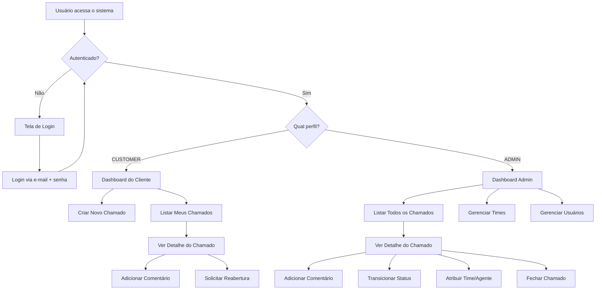
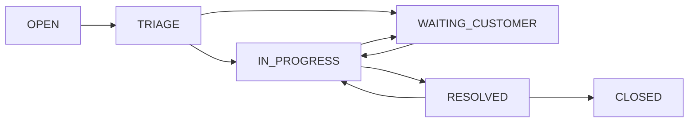
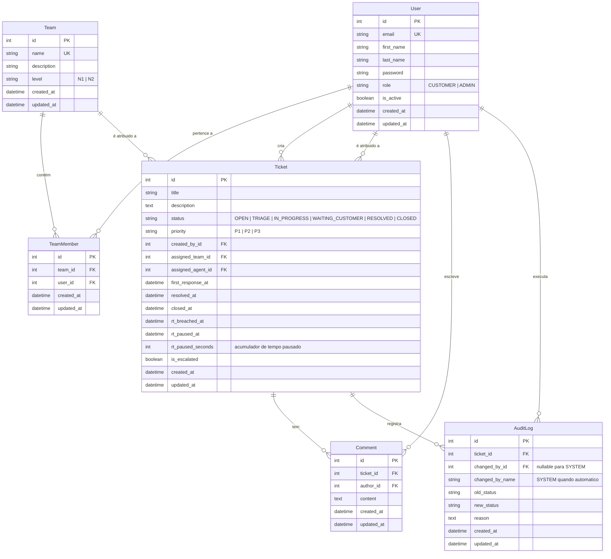

# PRD — HelpDesk DevOps

## 1. Visão Geral

Sistema de chamados (tickets) interno para times de DevOps, onde desenvolvedores (clientes) abrem solicitações de suporte que são triadas, atribuídas e resolvidas por agentes DevOps em dois níveis de atendimento (N1 e N2). O sistema oferece rastreabilidade completa, controle de SLA e escalonamento automático.

---

## 2. Sobre o Produto

**Nome:** HelpDesk DevOps  
**Tipo:** Aplicação web full-stack monolítica  
**Stack:** Python + Django + SQLite + TailwindCSS  
**Idioma da interface:** Português Brasileiro  
**Idioma do código:** Inglês  

O HelpDesk DevOps é uma plataforma web para gerenciamento de chamados de suporte técnico voltada para equipes de DevOps. O sistema permite que desenvolvedores (CUSTOMER) registrem problemas e acompanhem o progresso, enquanto o time de DevOps (ADMIN) triagem, atribua, resolva e encerre os chamados.

---

## 3. Propósito

- Centralizar e organizar as demandas de suporte DevOps em um único sistema.
- Garantir rastreabilidade total de cada chamado, desde a abertura até o encerramento.
- Controlar SLAs de primeiro atendimento (FRT) e resolução (RT) com escalonamento automático.
- Fornecer visibilidade sobre status, prioridade e responsáveis de cada chamado.
- Simplificar a comunicação entre clientes e agentes de suporte.

---

## 4. Público Alvo

| Perfil | Descrição |
|---|---|
| **CUSTOMER (Desenvolvedor)** | Abre chamados, adiciona comentários e acompanha o progresso |
| **ADMIN (Time DevOps)** | Atende chamados, transiciona status, resolve problemas, gerencia times e usuários, acesso total ao sistema |

---

## 5. Objetivos

1. Reduzir o tempo médio de resolução de chamados DevOps.
2. Garantir que 100% dos chamados tenham rastreabilidade de auditoria.
3. Automatizar o escalonamento de chamados que excedam o SLA.
4. Prover uma interface simples, moderna e intuitiva para todos os perfis.
5. Manter o projeto enxuto, sem over-engineering.

---

## 6. Requisitos Funcionais

### 6.1 Autenticação e Autorização

- RF-01: Login via e-mail (ao invés de username) usando sistema nativo de autenticação do Django.
- RF-02: Logout com redirecionamento para tela de login.
- RF-03: Controle de acesso baseado em perfil (RBAC): CUSTOMER, ADMIN.
- RF-04: Página de perfil do usuário com informações básicas.

### 6.2 Gestão de Chamados (Tickets)

- RF-05: CUSTOMER pode criar um novo chamado com título, descrição e prioridade (P1/P2/P3).
- RF-06: Listagem de chamados com filtros por status, prioridade e atribuição.
- RF-07: Visualização detalhada do chamado com histórico de comentários e auditoria.
- RF-08: Transições de status controladas conforme regras de negócio.
- RF-09: Atribuição de chamado a um time e a um agente (ADMIN).
- RF-10: Reabertura de chamado resolvido dentro de 7 dias, mediante justificativa.

### 6.3 Comentários

- RF-11: Qualquer usuário autenticado (exceto restrições de perfil) pode adicionar comentários.
- RF-12: Comentários registram autor, data/hora e conteúdo.

### 6.4 SLA e Escalonamento

- RF-13: Cálculo automático de FRT (First Response Time) — tempo desde criação até primeiro comentário de ADMIN.
- RF-14: Cálculo automático de RT (Resolution Time) — tempo desde criação até RESOLVED, pausando em WAITING_CUSTOMER.
- RF-15: Escalonamento automático para N2 quando o RT excede a meta da prioridade (ocorre apenas uma vez por ticket).

### 6.5 Auditoria

- RF-16: Registro de toda mudança de status com: quem fez, quando fez, status anterior, status novo e motivo (quando aplicável).
- RF-17: Registro de evento de auditoria para escalonamento automático (changed_by=SYSTEM).

### 6.6 Times

- RF-18: Cadastro de times (N1 e N2) com nome e descrição.
- RF-19: Associação de ADMINs a times.

### 6.7 Dashboard

- RF-20: Painel com visão geral de chamados: totais por status, por prioridade e SLA.

### 6.8 Flowchart — Fluxos de UX





---

## 7. Requisitos Não-Funcionais

- RNF-01: Interface responsiva e moderna utilizando TailwindCSS via Django Template Language.
- RNF-02: Banco de dados SQLite (padrão do Django).
- RNF-03: Código fonte em inglês, interface em português brasileiro.
- RNF-04: Uso de Class Based Views sempre que possível.
- RNF-05: Apps Django nomeadas com prefixo `app_` (ex: `app_accounts`, `app_tickets`).
- RNF-06: Campos `created_at` e `updated_at` em todos os models.
- RNF-07: Signals em arquivos `signals.py` dentro da app correspondente.
- RNF-08: Templates HTML sem quebra de linha.
- RNF-09: Código usando aspas simples sempre que possível.
- RNF-10: Sem Docker ou testes automatizados nas sprints iniciais.
- RNF-11: Templates centralizados em pasta `templates/` na raiz do projeto.

---

## 8. Arquitetura Técnica

### 8.1 Stack

| Camada | Tecnologia |
|---|---|
| **Linguagem** | Python 3.12+ |
| **Framework** | Django 5.x |
| **Frontend** | Django Template Language + TailwindCSS |
| **Banco de Dados** | SQLite 3 |
| **Autenticação** | Django Auth (customizado para login via e-mail) |
| **Servidor de Dev** | Django Development Server |

### 8.2 Estrutura do Projeto

```
helpdesk-devops/
├── manage.py
├── requirements.txt
├── prd.md
├── helpdesk/                    # Projeto Django (settings, urls, wsgi)
│   ├── __init__.py
│   ├── settings.py
│   ├── urls.py
│   └── wsgi.py
├── app_accounts/                # App: Autenticação e Usuários
│   ├── models.py
│   ├── views.py
│   ├── urls.py
│   ├── forms.py
│   ├── admin.py
│   ├── signals.py
│   └── managers.py
├── app_tickets/                 # App: Chamados
│   ├── models.py
│   ├── views.py
│   ├── urls.py
│   ├── forms.py
│   ├── admin.py
│   ├── signals.py
│   └── templatetags/
├── app_teams/                   # App: Times
│   ├── models.py
│   ├── views.py
│   ├── urls.py
│   ├── forms.py
│   └── admin.py
├── templates/                   # Templates globais
│   ├── base.html
│   ├── components/
│   │   ├── navbar.html
│   │   ├── sidebar.html
│   │   ├── footer.html
│   │   ├── alert.html
│   │   ├── badge.html
│   │   ├── card.html
│   │   ├── pagination.html
│   │   └── modal.html
│   ├── accounts/
│   │   ├── login.html
│   │   └── profile.html
│   ├── tickets/
│   │   ├── list.html
│   │   ├── detail.html
│   │   └── create.html
│   ├── teams/
│   │   ├── list.html
│   │   └── detail.html
│   └── dashboard/
│       └── index.html
└── static/
    └── css/
        ├── input.css
        └── output.css
```

### 8.3 Estrutura de Dados



### 8.4 Metas de SLA por Prioridade

| Prioridade | Meta FRT | Meta RT |
|---|---|---|
| **P1 — Crítica** | 30 minutos | 4 horas |
| **P2 — Alta** | 2 horas | 24 horas |
| **P3 — Média** | 8 horas | 72 horas |

---

## 9. Design System

### 9.1 Paleta de Cores (TailwindCSS)

| Elemento | Classes TailwindCSS | Uso |
|---|---|---|
| **Fundo principal** | `bg-gray-50` | Background geral do app |
| **Fundo card** | `bg-white` | Cards, modais e containers |
| **Primária** | `bg-indigo-600`, `hover:bg-indigo-700` | Botões primários, links ativos |
| **Primária gradient** | `bg-gradient-to-r from-indigo-600 to-purple-600` | Header, hero sections |
| **Secundária** | `bg-slate-600`, `hover:bg-slate-700` | Botões secundários |
| **Sucesso** | `bg-emerald-500` | Status resolvido, badges de sucesso |
| **Alerta** | `bg-amber-500` | Status em espera, avisos |
| **Perigo** | `bg-rose-500` | Erros, status crítico, P1 |
| **Informação** | `bg-sky-500` | Badges informativos |
| **Texto principal** | `text-gray-900` | Títulos e corpo de texto |
| **Texto secundário** | `text-gray-500` | Labels, subtítulos e timestamps |
| **Borda** | `border-gray-200` | Bordas de cards, inputs e tabelas |

### 9.2 Tipografia

- **Fonte principal:** Inter (Google Fonts)
- **Títulos de página:** `text-2xl font-bold text-gray-900`
- **Subtítulos:** `text-lg font-semibold text-gray-700`
- **Corpo:** `text-sm text-gray-600`
- **Labels:** `text-xs font-medium text-gray-500 uppercase tracking-wide`

### 9.3 Botões

| Tipo | Classes TailwindCSS |
|---|---|
| **Primário** | `px-4 py-2 bg-indigo-600 text-white font-medium rounded-lg shadow-sm hover:bg-indigo-700 transition-colors duration-200` |
| **Secundário** | `px-4 py-2 bg-white text-gray-700 font-medium rounded-lg border border-gray-300 shadow-sm hover:bg-gray-50 transition-colors duration-200` |
| **Perigo** | `px-4 py-2 bg-rose-600 text-white font-medium rounded-lg shadow-sm hover:bg-rose-700 transition-colors duration-200` |
| **Sucesso** | `px-4 py-2 bg-emerald-600 text-white font-medium rounded-lg shadow-sm hover:bg-emerald-700 transition-colors duration-200` |
| **Ghost** | `px-4 py-2 text-indigo-600 font-medium rounded-lg hover:bg-indigo-50 transition-colors duration-200` |

### 9.4 Inputs e Forms

```
<!-- Input padrão -->
<input type="text" class="w-full px-3 py-2 border border-gray-300 rounded-lg text-sm text-gray-900 placeholder-gray-400 focus:outline-none focus:ring-2 focus:ring-indigo-500 focus:border-indigo-500 transition-colors duration-200" placeholder="Digite aqui...">

<!-- Label -->
<label class="block text-sm font-medium text-gray-700 mb-1">Nome do campo</label>

<!-- Select -->
<select class="w-full px-3 py-2 border border-gray-300 rounded-lg text-sm text-gray-900 bg-white focus:outline-none focus:ring-2 focus:ring-indigo-500 focus:border-indigo-500 transition-colors duration-200">

<!-- Textarea -->
<textarea class="w-full px-3 py-2 border border-gray-300 rounded-lg text-sm text-gray-900 placeholder-gray-400 focus:outline-none focus:ring-2 focus:ring-indigo-500 focus:border-indigo-500 transition-colors duration-200" rows="4"></textarea>

<!-- Form container -->
<form class="space-y-4 bg-white p-6 rounded-xl shadow-sm border border-gray-200">
```

### 9.5 Cards

```
<!-- Card padrão -->
<div class="bg-white rounded-xl shadow-sm border border-gray-200 p-6 hover:shadow-md transition-shadow duration-200">

<!-- Card com header gradient -->
<div class="rounded-xl shadow-sm border border-gray-200 overflow-hidden">
  <div class="bg-gradient-to-r from-indigo-600 to-purple-600 px-6 py-4">
    <h3 class="text-white font-semibold">Título</h3>
  </div>
  <div class="bg-white p-6">Conteúdo</div>
</div>
```

### 9.6 Badges de Status

| Status | Classes TailwindCSS |
|---|---|
| **OPEN** | `px-2.5 py-0.5 text-xs font-medium rounded-full bg-sky-100 text-sky-700` |
| **TRIAGE** | `px-2.5 py-0.5 text-xs font-medium rounded-full bg-amber-100 text-amber-700` |
| **IN_PROGRESS** | `px-2.5 py-0.5 text-xs font-medium rounded-full bg-indigo-100 text-indigo-700` |
| **WAITING_CUSTOMER** | `px-2.5 py-0.5 text-xs font-medium rounded-full bg-orange-100 text-orange-700` |
| **RESOLVED** | `px-2.5 py-0.5 text-xs font-medium rounded-full bg-emerald-100 text-emerald-700` |
| **CLOSED** | `px-2.5 py-0.5 text-xs font-medium rounded-full bg-gray-100 text-gray-600` |

### 9.7 Badges de Prioridade

| Prioridade | Classes TailwindCSS |
|---|---|
| **P1 — Crítica** | `px-2.5 py-0.5 text-xs font-medium rounded-full bg-rose-100 text-rose-700` |
| **P2 — Alta** | `px-2.5 py-0.5 text-xs font-medium rounded-full bg-amber-100 text-amber-700` |
| **P3 — Média** | `px-2.5 py-0.5 text-xs font-medium rounded-full bg-sky-100 text-sky-700` |

### 9.8 Tabelas / Grid

```
<!-- Tabela -->
<div class="bg-white rounded-xl shadow-sm border border-gray-200 overflow-hidden">
  <table class="w-full text-sm text-left">
    <thead class="bg-gray-50 border-b border-gray-200">
      <tr>
        <th class="px-6 py-3 text-xs font-medium text-gray-500 uppercase tracking-wide">Coluna</th>
      </tr>
    </thead>
    <tbody class="divide-y divide-gray-100">
      <tr class="hover:bg-gray-50 transition-colors duration-150">
        <td class="px-6 py-4 text-gray-900">Valor</td>
      </tr>
    </tbody>
  </table>
</div>
```

### 9.9 Navbar

```
<!-- Navbar com gradient -->
<nav class="bg-gradient-to-r from-indigo-600 to-purple-600 shadow-lg">
  <div class="max-w-7xl mx-auto px-4 sm:px-6 lg:px-8">
    <div class="flex items-center justify-between h-16">
      <span class="text-white text-xl font-bold">HelpDesk DevOps</span>
      <!-- Nav links e avatar -->
    </div>
  </div>
</nav>
```

### 9.10 Layout Geral

- Container principal: `max-w-7xl mx-auto px-4 sm:px-6 lg:px-8 py-8`
- Fundo da página: `bg-gray-50 min-h-screen`
- Grid responsivo: `grid grid-cols-1 md:grid-cols-2 lg:grid-cols-4 gap-6`
- Espaçamento entre seções: `space-y-6`

### 9.11 Alertas / Mensagens

| Tipo | Classes TailwindCSS |
|---|---|
| **Sucesso** | `p-4 rounded-lg bg-emerald-50 border border-emerald-200 text-emerald-800 text-sm` |
| **Erro** | `p-4 rounded-lg bg-rose-50 border border-rose-200 text-rose-800 text-sm` |
| **Aviso** | `p-4 rounded-lg bg-amber-50 border border-amber-200 text-amber-800 text-sm` |
| **Info** | `p-4 rounded-lg bg-sky-50 border border-sky-200 text-sky-800 text-sm` |

### 9.12 Templates

Todos os templates HTML ficam em `templates/` na raiz do projeto. O `base.html` define o layout padrão com navbar, área de conteúdo e footer. Cada template filho estende `base.html` usando `` e preenche os blocos ``, ``, etc.

---

## 10. User Stories

### 10.1 Épico: Autenticação e Gestão de Usuários

**US-01: Como usuário, quero fazer login com meu e-mail e senha para acessar o sistema.**

- Critérios de aceite:
  - O campo de login aceita e-mail (não username).
  - Login com credenciais válidas redireciona para o dashboard.
  - Login com credenciais inválidas exibe mensagem de erro.
  - Usuário inativo não consegue autenticar.

**US-02: Como usuário autenticado, quero fazer logout para encerrar minha sessão.**

- Critérios de aceite:
  - Após logout, o usuário é redirecionado para a tela de login.
  - Não é possível acessar páginas protegidas após logout.

**US-03: Como usuário autenticado, quero visualizar meu perfil com minhas informações.**

- Critérios de aceite:
  - Página exibe nome, e-mail e perfil (role) do usuário.

### 10.2 Épico: Gestão de Chamados

**US-04: Como CUSTOMER, quero criar um chamado informando título, descrição e prioridade.**

- Critérios de aceite:
  - Formulário com campos obrigatórios: título, descrição, prioridade.
  - Chamado é criado com status OPEN.
  - O CUSTOMER é automaticamente registrado como autor do chamado.

**US-05: Como CUSTOMER, quero listar meus chamados para acompanhar o andamento.**

- Critérios de aceite:
  - Lista exibe apenas chamados do CUSTOMER logado.
  - Filtros por status e prioridade disponíveis.
  - Paginação implementada.

**US-06: Como ADMIN, quero visualizar todos os chamados para gerenciar o atendimento.**

- Critérios de aceite:
  - Lista exibe todos os chamados do sistema.
  - Filtros por status, prioridade e atribuição disponíveis.

**US-07: Como ADMIN, quero transicionar o status de um chamado para avançar o atendimento.**

- Critérios de aceite:
  - Apenas transições permitidas estão disponíveis como opções.
  - Transição TRIAGE → IN_PROGRESS exige time e agente atribuídos.
  - Transições para WAITING_CUSTOMER e RESOLVED exigem reason.
  - Toda transição gera registro de auditoria.

**US-08: Como ADMIN, quero atribuir um chamado a um time e a mim ou outro ADMIN.**

- Critérios de aceite:
  - ADMIN pode alterar `assigned_team` e `assigned_agent`.
  - O agente atribuído deve estar ativo.
  - A mudança gera registro de auditoria.

**US-09: Como ADMIN, quero fechar um chamado resolvido.**

- Critérios de aceite:
  - Só é possível fechar chamado com status RESOLVED.
  - Deve existir pelo menos um comentário de ADMIN descrevendo a solução.

**US-10: Como CUSTOMER, quero reabrir um chamado que foi resolvido incorretamente.**

- Critérios de aceite:
  - Reabertura só é possível se o chamado foi resolvido há no máximo 7 dias.
  - Exige comentário do CUSTOMER após `resolved_at`.
  - Exige reason obrigatório.
  - Status muda de RESOLVED para IN_PROGRESS.

### 10.3 Épico: Comentários

**US-11: Como usuário, quero adicionar comentários a um chamado para comunicar informações.**

- Critérios de aceite:
  - Comentário registra autor, data/hora e conteúdo.
  - Comentário aparece no histórico do chamado em ordem cronológica.

### 10.4 Épico: SLA e Escalonamento

**US-12: Como ADMIN, quero visualizar os indicadores de SLA de cada chamado.**

- Critérios de aceite:
  - FRT exibido com indicador visual (dentro/fora da meta).
  - RT exibido com indicador visual (dentro/fora da meta).
  - Tempo é exibido em formato legível (ex: "2h 30min").

**US-13: Como sistema, quero escalar automaticamente chamados que excedam o RT.**

- Critérios de aceite:
  - Quando o RT excede a meta, o campo `rt_breached_at` é preenchido.
  - O chamado é movido para o time N2.
  - Um evento de auditoria é criado com `changed_by=SYSTEM` e `reason=RT_BREACHED_ESCALATED`.
  - O escalonamento ocorre no máximo uma vez por chamado.

### 10.5 Épico: Gestão de Times

**US-14: Como ADMIN, quero cadastrar e gerenciar times (N1 e N2).**

- Critérios de aceite:
  - CRUD de times com nome, descrição e nível (N1/N2).
  - Associação de ADMINs a times.

### 10.6 Épico: Dashboard

**US-15: Como usuário autenticado, quero ver um dashboard com resumo dos chamados.**

- Critérios de aceite:
  - CUSTOMER vê resumo dos seus chamados por status.
  - ADMIN vê resumo geral com totais por status, prioridade e indicadores de SLA.

---

## 11. Métricas de Sucesso

### 11.1 KPIs de Produto

| KPI | Meta | Descrição |
|---|---|---|
| **FRT dentro da meta** | ≥ 90% | Percentual de chamados com FRT dentro do SLA |
| **RT dentro da meta** | ≥ 85% | Percentual de chamados com RT dentro do SLA |
| **Taxa de escalonamento** | ≤ 10% | Percentual de chamados escalados para N2 |
| **Taxa de reabertura** | ≤ 5% | Percentual de chamados reabertos após resolução |

### 11.2 KPIs de Usuário

| KPI | Meta | Descrição |
|---|---|---|
| **Adoção do sistema** | 100% do time DevOps | Todos os ADMINs usando o sistema |
| **Chamados via sistema** | 100% | Todos os chamados registrados no sistema |
| **Tempo médio de resolução** | Redução de 30% | Comparado ao processo anterior |

### 11.3 KPIs Técnicos

| KPI | Meta | Descrição |
|---|---|---|
| **Disponibilidade** | 99% | Uptime do sistema |
| **Tempo de resposta** | < 2s | Carregamento de páginas |
| **Cobertura de auditoria** | 100% | Toda mudança de status auditada |

---

## 12. Riscos e Mitigações

| # | Risco | Impacto | Probabilidade | Mitigação |
|---|---|---|---|---|
| R1 | SQLite não suporta acesso concorrente intenso | Alto | Baixo | O projeto é para time interno com poucos acessos simultâneos. Migrar para PostgreSQL se necessário no futuro |
| R2 | SLA calculado em tempo corrido pode ser impreciso em horário não comercial | Médio | Médio | Para MVP, manter em tempo corrido. Implementar horário comercial em sprint futura se necessário |
| R3 | Escalonamento automático executado apenas sob demanda (não em tempo real) | Médio | Médio | Implementar via Django management command agendado ou verificação na abertura de tela do ticket |
| R4 | Falta de testes automatizados na fase inicial | Médio | Alto | Testes manuais durante o desenvolvimento. Testes unitários e de integração previstos para sprints finais |
| R5 | Dependência do TailwindCSS via CDN ou build local | Baixo | Baixo | Usar TailwindCSS standalone CLI para build local do CSS |

---

## 13. Lista de Tarefas

### Sprint 1 — Fundação do Projeto e Autenticação

#### 1.1 Configuração Inicial do Projeto

- [ ] 1.1.1 Criar ambiente virtual Python e instalar Django
  - Criar venv, ativar, instalar Django 5.x. Gerar `requirements.txt`.
- [ ] 1.1.2 Criar o projeto Django `helpdesk`
  - Executar `django-admin startproject helpdesk .` na raiz do repositório.
- [ ] 1.1.3 Configurar `settings.py` base
  - `LANGUAGE_CODE = 'pt-br'`, `TIME_ZONE = 'America/Sao_Paulo'`, `USE_TZ = True`.
  - Configurar `TEMPLATES` com `DIRS` apontando para `templates/` na raiz.
  - Configurar `STATICFILES_DIRS` apontando para `static/` na raiz.
  - Definir `AUTH_USER_MODEL = 'app_accounts.User'`.
  - Definir `LOGIN_URL`, `LOGIN_REDIRECT_URL`, `LOGOUT_REDIRECT_URL`.
- [ ] 1.1.4 Configurar TailwindCSS standalone
  - Baixar TailwindCSS standalone CLI. Criar `static/css/input.css` com diretivas `@tailwind`. Configurar `tailwind.config.js` para escanear `templates/**/*.html`. Gerar `static/css/output.css`.
- [ ] 1.1.5 Criar estrutura de pastas `templates/` e `static/`
  - Criar `templates/`, `templates/components/`, `templates/accounts/`, `templates/tickets/`, `templates/teams/`, `templates/dashboard/`, `static/css/`.

#### 1.2 App `app_accounts` — Modelo de Usuário Customizado

- [ ] 1.2.1 Criar a app `app_accounts`
  - Executar `python manage.py startapp app_accounts`. Registrar em `INSTALLED_APPS`.
- [ ] 1.2.2 Criar o model `User` customizado
  - Estender `AbstractUser`. Remover campo `username` (definir `USERNAME_FIELD = 'email'`). Campos: `email` (unique), `first_name`, `last_name`, `role` (CharField com choices: CUSTOMER, ADMIN), `is_active`, `created_at`, `updated_at`.
- [ ] 1.2.3 Criar `UserManager` customizado
  - Em `managers.py`, implementar `create_user` e `create_superuser` usando e-mail como identificador.
- [ ] 1.2.4 Registrar o model `User` no admin do Django
  - Em `admin.py`, criar `UserAdmin` customizado herdando de `django.contrib.auth.admin.UserAdmin`. Configurar `fieldsets`, `add_fieldsets`, `list_display`, `ordering`.
- [ ] 1.2.5 Gerar e aplicar migrations do `app_accounts`
  - Executar `python manage.py makemigrations app_accounts` e `python manage.py migrate`.
- [ ] 1.2.6 Criar superusuário para testes
  - Executar `python manage.py createsuperuser` com e-mail para validar o modelo customizado.

#### 1.3 App `app_accounts` — Autenticação (Login/Logout)

- [ ] 1.3.1 Criar `EmailAuthBackend` para autenticação via e-mail
  - Em `backends.py`, implementar backend customizado que autentica por e-mail. Registrar em `settings.AUTHENTICATION_BACKENDS`.
- [ ] 1.3.2 Criar formulário de login customizado
  - Em `forms.py`, criar `LoginForm` com campos `email` e `password`. Utilizar widgets com classes TailwindCSS.
- [ ] 1.3.3 Criar view de login (CBV)
  - Em `views.py`, implementar `LoginView` usando `django.contrib.auth.views.LoginView` customizada para usar o `LoginForm`.
- [ ] 1.3.4 Criar view de logout (CBV)
  - Utilizar `django.contrib.auth.views.LogoutView` com redirecionamento para login.
- [ ] 1.3.5 Criar template `login.html`
  - Template estende `base.html`. Formulário centralizado com logo, campos de e-mail e senha, botão de entrar. Design com gradient e card centralizado. Sem quebras de linha no HTML.
- [ ] 1.3.6 Configurar URLs de autenticação
  - Em `app_accounts/urls.py`, mapear rotas `login/` e `logout/`. Incluir em `helpdesk/urls.py`.

#### 1.4 Templates Base e Componentes Visuais

- [ ] 1.4.1 Criar `base.html`
  - Layout principal com: Google Fonts (Inter), link para `output.css`, navbar, mensagens do Django (`django.contrib.messages`), área de conteúdo (``), footer. Fundo `bg-gray-50`. Sem quebras de linha.
- [ ] 1.4.2 Criar componente `navbar.html`
  - Navbar com gradient `from-indigo-600 to-purple-600`. Logo "HelpDesk DevOps". Links de navegação conforme perfil do usuário. Menu de usuário com nome e opção de logout. Responsivo com menu mobile.
- [ ] 1.4.3 Criar componente `footer.html`
  - Footer simples com copyright e ano. Estilizado com `bg-white border-t border-gray-200`.
- [ ] 1.4.4 Criar componente `alert.html`
  - Componente para exibir mensagens do Django (`messages`). Mapear tags do Django (success, error, warning, info) para classes TailwindCSS correspondentes.
- [ ] 1.4.5 Criar componente `badge.html`
  - Template tag ou include para badges de status e prioridade. Recebe tipo e valor, retorna HTML com classes TailwindCSS corretas.
- [ ] 1.4.6 Criar componente `pagination.html`
  - Componente reutilizável de paginação. Recebe objeto `page_obj`. Botões anterior/próximo e indicador de página atual.

---

### Sprint 2 — Gestão de Times e Modelo de Chamados

#### 2.1 App `app_teams` — Times

- [ ] 2.1.1 Criar a app `app_teams`
  - Executar `python manage.py startapp app_teams`. Registrar em `INSTALLED_APPS`.
- [ ] 2.1.2 Criar o model `Team`
  - Campos: `name` (unique), `description` (text, opcional), `level` (CharField choices: N1, N2), `created_at`, `updated_at`.
- [ ] 2.1.3 Criar o model `TeamMember`
  - Campos: `team` (FK para Team), `user` (FK para User), `created_at`, `updated_at`. Constraint unique_together para `(team, user)`.
- [ ] 2.1.4 Registrar models no admin do Django
  - `TeamAdmin` com `list_display = ['name', 'level', 'created_at']`. `TeamMemberAdmin` com inline ou `list_display`.
- [ ] 2.1.5 Gerar e aplicar migrations da app `app_teams`
  - `python manage.py makemigrations app_teams` e `python manage.py migrate`.
- [ ] 2.1.6 Criar views de listagem e detalhe de times (CBV)
  - `TeamListView` (ListView) com paginação. `TeamDetailView` (DetailView) exibindo membros do time.
- [ ] 2.1.7 Criar templates `teams/list.html` e `teams/detail.html`
  - Listagem em formato de cards ou tabela. Detalhe mostrando informações do time e tabela de membros. Seguir design system.
- [ ] 2.1.8 Configurar URLs do `app_teams`
  - Rotas: `teams/` (listagem), `teams/<int:pk>/` (detalhe). Incluir em `helpdesk/urls.py`.

#### 2.2 App `app_tickets` — Modelo de Chamados

- [ ] 2.2.1 Criar a app `app_tickets`
  - Executar `python manage.py startapp app_tickets`. Registrar em `INSTALLED_APPS`.
- [ ] 2.2.2 Criar o model `Ticket`
  - Campos: `title`, `description` (TextField), `status` (CharField choices), `priority` (CharField choices), `created_by` (FK User), `assigned_team` (FK Team, null), `assigned_agent` (FK User, null), `first_response_at` (nullable), `resolved_at` (nullable), `closed_at` (nullable), `rt_breached_at` (nullable), `rt_paused_at` (nullable), `rt_paused_seconds` (IntegerField, default=0), `is_escalated` (BooleanField, default=False), `created_at`, `updated_at`.
- [ ] 2.2.3 Criar o model `Comment`
  - Campos: `ticket` (FK Ticket), `author` (FK User), `content` (TextField), `created_at`, `updated_at`.
- [ ] 2.2.4 Criar o model `AuditLog`
  - Campos: `ticket` (FK Ticket), `changed_by` (FK User, null), `changed_by_name` (CharField), `old_status` (CharField, nullable), `new_status` (CharField, nullable), `reason` (TextField, blank), `created_at`, `updated_at`.
- [ ] 2.2.5 Registrar models no admin do Django
  - `TicketAdmin` com `list_display`, `list_filter`, `search_fields`. `CommentAdmin` e `AuditLogAdmin` básicos.
- [ ] 2.2.6 Gerar e aplicar migrations da app `app_tickets`
  - `python manage.py makemigrations app_tickets` e `python manage.py migrate`.

---

### Sprint 3 — CRUD de Chamados e Comentários

#### 3.1 Criação de Chamados

- [ ] 3.1.1 Criar formulário `TicketCreateForm`
  - Em `app_tickets/forms.py`. Campos: `title`, `description`, `priority`. Widgets com classes TailwindCSS.
- [ ] 3.1.2 Criar view `TicketCreateView` (CreateView)
  - Apenas CUSTOMER pode criar. Preencher `created_by` automaticamente com `request.user`. Definir `status = OPEN`. Após criação, criar AuditLog com status OPEN. Redirecionar para listagem.
- [ ] 3.1.3 Criar template `tickets/create.html`
  - Formulário dentro de card com título "Novo Chamado". Campos estilizados conforme design system.
- [ ] 3.1.4 Criar transição automática OPEN → TRIAGE
  - No `save` ou via signal, após criação do ticket, transicionar para TRIAGE e criar AuditLog correspondente.

#### 3.2 Listagem de Chamados

- [ ] 3.2.1 Criar view `TicketListView` (ListView)
  - Filtrar chamados conforme perfil: CUSTOMER vê seus chamados; ADMIN vê todos. Suportar filtros por status e prioridade via query params. Paginação.
- [ ] 3.2.2 Criar template `tickets/list.html`
  - Tabela responsiva com colunas: ID, título, status (badge), prioridade (badge), atribuído a, data de criação. Filtros no topo. Botão de "Novo Chamado" para CUSTOMER. Links para detalhe.

#### 3.3 Detalhe do Chamado e Comentários

- [ ] 3.3.1 Criar view `TicketDetailView` (DetailView)
  - Exibir todas as informações do chamado. Listar comentários ordenados por data. Exibir histórico de auditoria. Exibir indicadores de SLA (FRT e RT).
- [ ] 3.3.2 Criar formulário `CommentForm`
  - Campo `content` (textarea). Widget com classes TailwindCSS.
- [ ] 3.3.3 Implementar adição de comentário na view de detalhe
  - Tratar POST para adicionar comentário. Preencher `author` com `request.user`. Se é o primeiro comentário de ADMIN, registrar `first_response_at` no ticket.
- [ ] 3.3.4 Criar template `tickets/detail.html`
  - Layout em seções: cabeçalho com título/status/prioridade, informações do chamado, seção de SLA, ações disponíveis conforme perfil e regras, lista de comentários, formulário de novo comentário, histórico de auditoria em timeline.

---

### Sprint 4 — Transições de Status, RBAC e Regras de Negócio

#### 4.1 Engine de Transições de Status

- [ ] 4.1.1 Criar módulo `app_tickets/services.py` com lógica de transição
  - Definir constantes `VALID_TRANSITIONS` como dicionário de transições permitidas. Criar função `transition_ticket(ticket, new_status, user, reason=None)` que valida: se a transição é permitida, se o usuário tem permissão, se regras específicas estão satisfeitas.
- [ ] 4.1.2 Implementar regras de RBAC por transição
  - CUSTOMER: não pode transicionar (exceto reabertura via regra específica). ADMIN: pode todas as transições (TRIAGE→IN_PROGRESS, IN_PROGRESS→WAITING_CUSTOMER, WAITING_CUSTOMER→IN_PROGRESS, IN_PROGRESS→RESOLVED, RESOLVED→CLOSED).
- [ ] 4.1.3 Implementar validação de atribuição para TRIAGE → IN_PROGRESS
  - Verificar que `assigned_team_id` e `assigned_agent_id` estão preenchidos. Verificar que o agente atribuído está ativo (`is_active=True`).
- [ ] 4.1.4 Implementar reason obrigatório para transições específicas
  - Transições para WAITING_CUSTOMER e RESOLVED exigem `reason` não vazio. Reabertura (RESOLVED → IN_PROGRESS) exige `reason`.
- [ ] 4.1.5 Implementar regra de fechamento (RESOLVED → CLOSED)
  - Verificar que o usuário é ADMIN. Verificar que existe pelo menos um comentário de usuário com role ADMIN no ticket.
- [ ] 4.1.6 Implementar regra de reabertura (RESOLVED → IN_PROGRESS)
  - Verificar que não passaram mais de 7 dias desde `resolved_at`. Verificar que existe um comentário do CUSTOMER com `created_at > resolved_at`. Exigir `reason`.

#### 4.2 Views para Transições

- [ ] 4.2.1 Criar view `TicketTransitionView`
  - View que recebe POST com `new_status` e `reason` (quando necessário). Chamar `transition_ticket()`. Gerar AuditLog com `old_status`, `new_status`, `changed_by`, `reason`. Atualizar campos temporais (`resolved_at`, `closed_at`, etc). Redirecionar para detalhe do ticket.
- [ ] 4.2.2 Criar formulário de transição com campo de reason
  - Formulário dinâmico para transições que exigem reason. Modal ou seção colapsável no detalhe do ticket.

#### 4.3 View de Atribuição

- [ ] 4.3.1 Criar view `TicketAssignView`
  - ADMIN pode alterar `assigned_team` e `assigned_agent`. Gerar AuditLog. Redirecionar para detalhe.
- [ ] 4.3.2 Criar formulário de atribuição
  - Botão "Atribuir a Mim" e selects de time e agente (filtrado por time). Apenas ADMIN. Widgets com classes TailwindCSS.

---

### Sprint 5 — SLA, Escalonamento e Dashboard

#### 5.1 Cálculo de SLA

- [ ] 5.1.1 Criar módulo `app_tickets/sla.py` com funções de cálculo
  - Função `calculate_frt(ticket)`: retorna timedelta entre `created_at` e `first_response_at`. Retorna None se não respondido. Função `calculate_rt(ticket)`: retorna timedelta entre `created_at` e `resolved_at` (ou now), subtraindo `rt_paused_seconds` e tempo atual em pausa (se `rt_paused_at` preenchido).
- [ ] 5.1.2 Criar constantes de SLA por prioridade
  - Em `app_tickets/sla.py`: dicionário `SLA_TARGETS` com chaves P1/P2/P3 e valores de FRT e RT em timedelta.
- [ ] 5.1.3 Implementar pausa do RT ao entrar em WAITING_CUSTOMER
  - No `transition_ticket()`, ao transicionar para WAITING_CUSTOMER: preencher `rt_paused_at = now`.
- [ ] 5.1.4 Implementar retomada do RT ao sair de WAITING_CUSTOMER
  - No `transition_ticket()`, ao transicionar de WAITING_CUSTOMER para IN_PROGRESS: calcular tempo pausado, somar a `rt_paused_seconds`, limpar `rt_paused_at`.
- [ ] 5.1.5 Exibir indicadores de SLA no detalhe do ticket
  - Mostrar tempo de FRT com indicador visual (verde se dentro da meta, vermelho se fora). Mostrar tempo de RT com indicador visual. Formatar tempo em "Xh Xmin".

#### 5.2 Escalonamento Automático

- [ ] 5.2.1 Criar management command `check_sla_breaches`
  - Em `app_tickets/management/commands/check_sla_breaches.py`. Buscar tickets com status ativo (não RESOLVED/CLOSED) cuja `is_escalated=False`. Para cada ticket, calcular RT e comparar com meta. Se excedeu: preencher `rt_breached_at`, mover `assigned_team` para time N2, criar AuditLog com `changed_by_name=SYSTEM`, `reason=RT_BREACHED_ESCALATED`, marcar `is_escalated=True`.
- [ ] 5.2.2 Implementar verificação de escalonamento sob demanda
  - No `TicketDetailView`, ao acessar o detalhe, executar verificação de SLA para o ticket exibido (garantir escalonamento mesmo sem cron).

#### 5.3 Dashboard

- [ ] 5.3.1 Criar view `DashboardView` (TemplateView)
  - Calcular métricas e passar no contexto: total de chamados por status, total por prioridade, chamados com SLA estourado, chamados em aberto. CUSTOMER vê apenas seus chamados; ADMIN vê todos.
- [ ] 5.3.2 Criar template `dashboard/index.html`
  - Cards de resumo no topo (grid responsivo). Cada card com ícone, título, valor e cor. Cards de prioridade com gradients. Lista dos chamados mais recentes abaixo.
- [ ] 5.3.3 Configurar URL do dashboard como página inicial
  - Rota `/` redireciona para dashboard. Dashboard requer login (`LoginRequiredMixin`).

---

### Sprint 6 — Perfil de Usuário e Refinamentos

#### 6.1 Perfil do Usuário

- [ ] 6.1.1 Criar view `ProfileView` (DetailView)
  - Exibir informações do usuário logado: nome, e-mail, perfil, times associados.
- [ ] 6.1.2 Criar template `accounts/profile.html`
  - Card com informações do perfil. Lista de times que o usuário participa. Seguir design system.

#### 6.2 Refinamentos de Interface

- [ ] 6.2.1 Implementar responsividade completa
  - Testar e ajustar todos os templates para mobile, tablet e desktop. Menu mobile com hamburger na navbar.
- [ ] 6.2.2 Implementar mensagens de feedback do Django
  - Exibir mensagens de sucesso, erro e aviso após ações (criação de chamado, transições, login, etc).
- [ ] 6.2.3 Implementar breadcrumbs
  - Componente de breadcrumb reutilizável. Adicionar em páginas de detalhe e criação.
- [ ] 6.2.4 Revisar e padronizar todos os templates
  - Garantir que todos seguem o design system. Verificar que não há quebras de linha nos HTMLs. Garantir que badges, tabelas e formulários estão consistentes.

---

### Sprint 7 — Testes e Docker (Futuro)

#### 7.1 Testes Automatizados

- [ ] 7.1.1 Configurar pytest com pytest-django
- [ ] 7.1.2 Escrever testes unitários para models
- [ ] 7.1.3 Escrever testes unitários para services (transições)
- [ ] 7.1.4 Escrever testes unitários para cálculos de SLA
- [ ] 7.1.5 Escrever testes de integração para views

#### 7.2 Docker

- [ ] 7.2.1 Criar Dockerfile
- [ ] 7.2.2 Criar docker-compose.yml
- [ ] 7.2.3 Documentar processo de deploy
